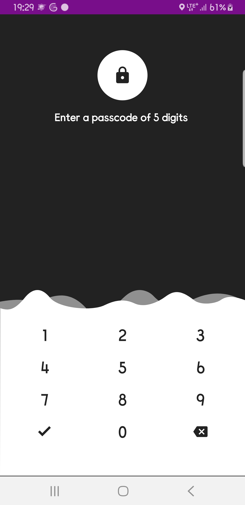
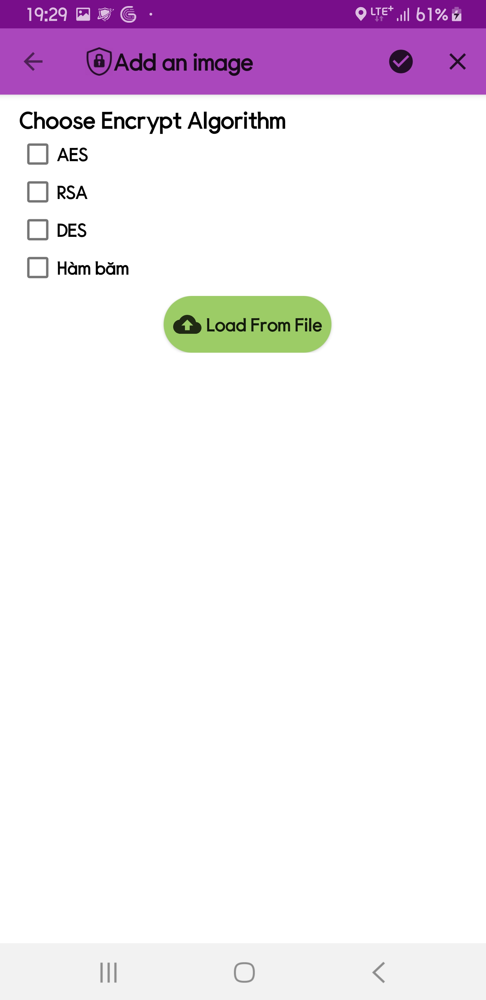
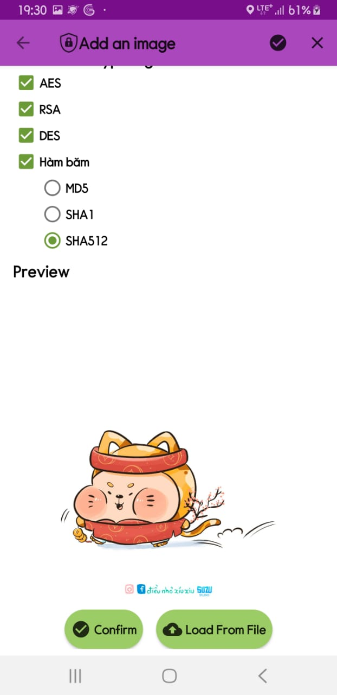
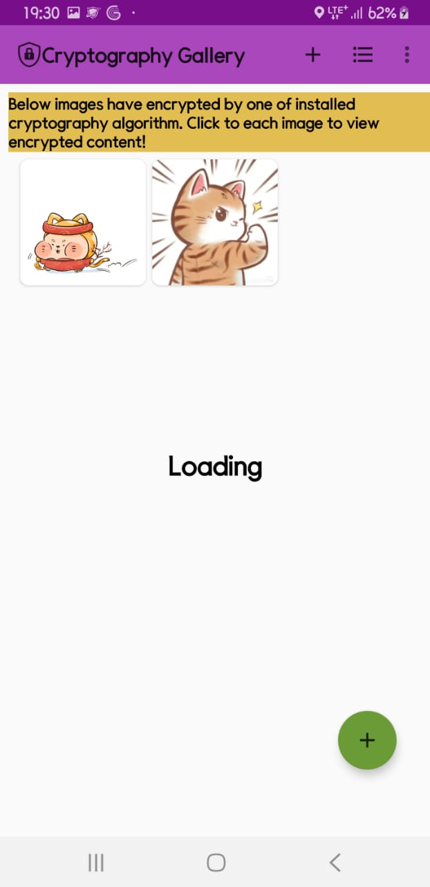
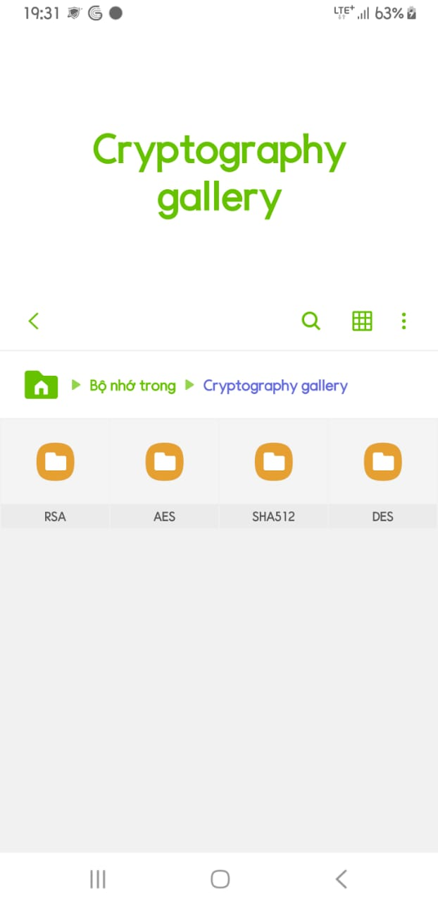
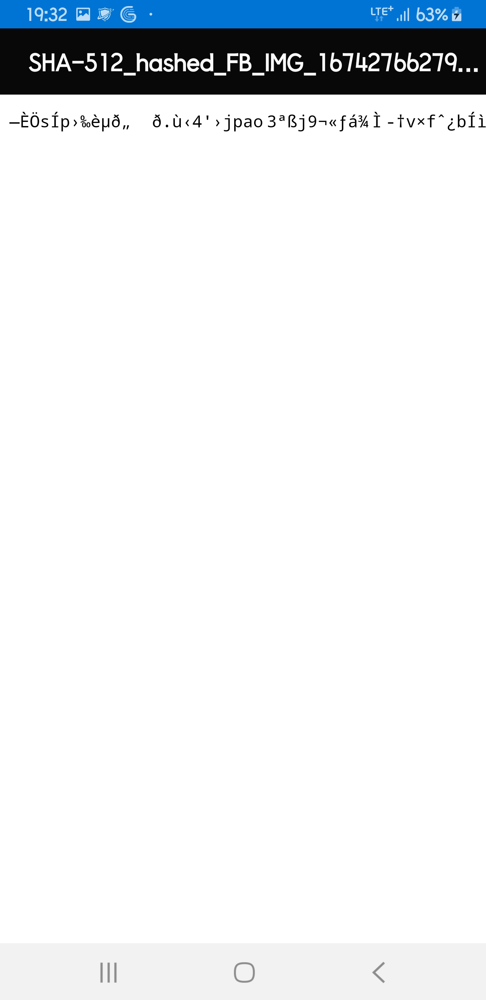
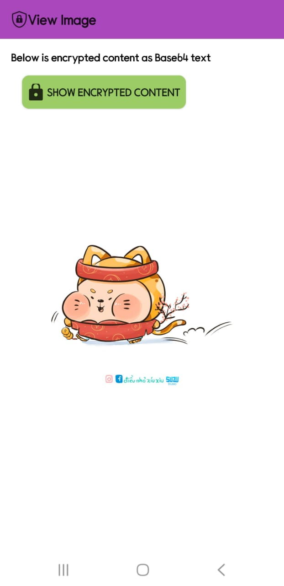

# Thư viện ảnh mã hoá Cryptography Image Gallery!

Cryptography Image Gallery là ứng dụng cho phép bạn mã hoá các bức ảnh bằng các thuật toán mã hoá mạnh mẽ: AES, DES, RSA.

Hay thực hiện hash các bức ảnh thành dạng Message Digest với hàm băm: MD5, SHA-1, SHA-256, SHA-512

Ngoài ra có khả năng quản lý các bức ảnh đã được mã hoá.
  
...
  
# Contributors

# Authors
 - [@Hoàng Văn Giang](https://github.com/HVgiang86/student-management-utt)
 
 <a href="https://www.facebook.com/HVGiang86">Hoàng Giang</a>

    
<a href="https://github.com/HVgiang86">HVGiang86</a>

 
# Problem
**Mục tiêu**
Trong project này, chúng ta sẽ xây dựng một ứng dụng cho phép mã hoá các bức ảnh trong thư viện ảnh bằng các thuật toán: RSA, AES, DES, MD5, SHA-1, SHA-256, SHA-512
**Hình thức**
Cần xây dựng một ứng dụng Android có các tính năng chọn ảnh, chọn thuật toán mã hoá, quản lý các bức ảnh đã mã hoá, xem nội dung mã hoá, xem ảnh gốc

# Cryptography Documents

Đây là báo cáo về các thuật toán mã hoá sử dụng:

<a href="https://hvgiang86.notion.site/M-ho-0c7639e7a5374ef3b3618bfd50ff0f53"><b>Cryptography In Android Report</b></a>

## Feature
Ứng dụng này cho phép bạn:

 - Chọn ảnh để mã hoá
 - Chọn một trong các thuật toán mã hoá: AES, DES, RSA, MD5, SHA-1, SHA-256, SHA-512
 - Quản lý các bức ảnh đã mã hoá
 - Xem nội dung mã hoá
 - Các file khoá, mã hoá được ghi vào các thư mục tương ứng trong hệ thống tập tin
 - Yêu cầu pin code mỗi khi đăng nhập vào ứng dụng

# Permission
Ứng dụng yêu cầu quyền quản lý và truy cập hệ thống tập tin

# Screenshot

  
- screenshot
  

